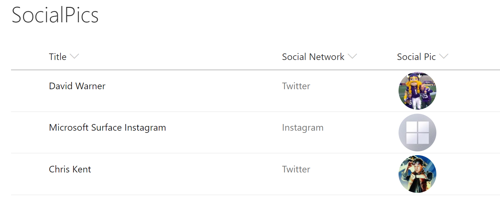

# Display Social Media Profile Pics Using Social Media Handles

## Summary

Using the social media handles supported by https://unavatar.now.sh, social media profile pictures are displayed in a circle and clicking them will open the user's social media page in a new window. The handle is also displayed as a tooltip when hovering over the profile image.

> Note: https://unavatar.now.sh currently supports a variety of services including Twitter, Facebook, Instagram and GitHub.

### Column Types
This format will work with Choice and Text columns without any changes. To use Lookup columns, you'll need to change the 2 occurences of `@currentField` to `@currentField.lookupValue`.

The field values are case insensitve and should be just the user's twitter handle with no @.

## View requirements
This format expects to be applied to a text based column containing the username for a given social network. The view should have the following fields:

|Type                 |Internal Name  |Required|
|---------------------|---------------|:------:|
|Choice               |SocialNetwork  |Yes     |
|Single line of text  |SocialPic      |Yes      |

## Sample

Solution|Author(s)
--------|---------
generic-socialpic.json | [David Warner II](https://github.com/PopWarner) ([@DavidWarnerII](https://twitter.com/davidwarnerii))

## Version history

Version|Date|Comments
-------|----|--------
1.0|July 21, 2018|Initial release
1.1|August 20, 2018|Updated to use Excel-style expressions
1.2|August 20, 2020|Updated to use the unavatar service for profile picture

## Disclaimer
**THIS CODE IS PROVIDED *AS IS* WITHOUT WARRANTY OF ANY KIND, EITHER EXPRESS OR IMPLIED, INCLUDING ANY IMPLIED WARRANTIES OF FITNESS FOR A PARTICULAR PURPOSE, MERCHANTABILITY, OR NON-INFRINGEMENT.**

---

## Additional notes

A similar wizard is also included in the [Column Formatter](https://github.com/SharePoint/sp-dev-solutions/blob/master/solutions/ColumnFormatter/README.md) webpart that allows full customization.

- [Use column formatting to customize SharePoint](https://docs.microsoft.com/en-us/sharepoint/dev/declarative-customization/column-formatting)

> An additional version using Abstract Tree Syntax (AST) is also provided for environments where the Excel-style expressions are not supported.

