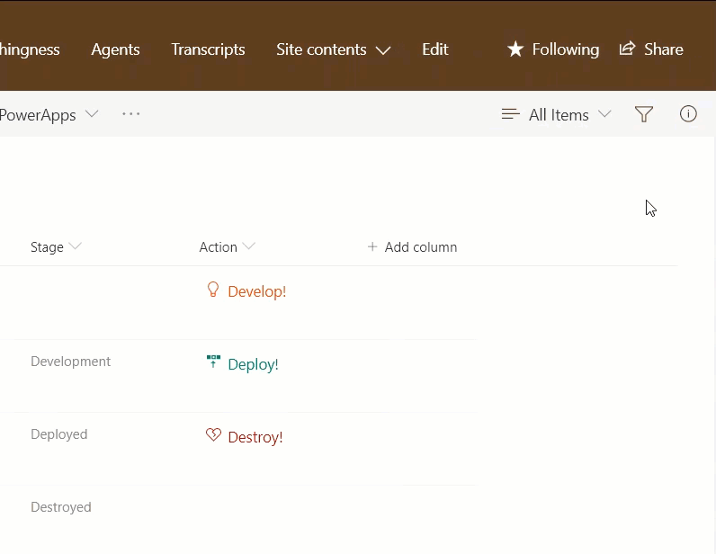

# Conditionally Launch Flow for Item

## Summary
You can use column formatting to create buttons that, when clicked, run Flows on the corresponding list item. The Flow Launch Panel will be displayed after clicking the button allowing the user to specify any required data and then run the flow. This is demonstrated in the [Generic-Start-Flow](../generic-start-flow) sample.

This sample demonstrates how to take it further to conditionally change which flow is launched or if a flow button option should be shown at all.

Column Formatting allows you to use expressions for individual attributes. This provides us a lot of power, but doesn't always make it obvious when we want to make multiple changes based on the same expression or conditionally include/exclude elements.

This sample adjusts the color, icon, text, visibility, and the flow launched based on another column in the view, `Stage`. The same basic expression (nested if operations) is used for each of the properties individually. Here's a table showing the conditional results:

|Stage|Class|Icon|Text|Visible|Flow|
|---|---|---|---|---|---|
|_blank_|ms-fontColor-orangeLight|Lightbulb|Develop!|Yes|b60a26d3-fd87-4947-9d1d-344cb31d953a|
|Development|ms-fontColor-teal|Deploy|Deploy!|Yes|3a27a39c-0ec9-4342-8fe3-bfb37fefc3da|
|Deployed|ms-fontColor-redDark|HeartBroken|Destroy!|Yes|3091d383-f8ed-48da-9962-bd7c24e70688|
|Destroyed|ms-fontColor-redDark|HeartBroken|Destroy!|**No**|3091d383-f8ed-48da-9962-bd7c24e70688|

Notice that "Destroyed" condition has values for class, icon, text, etc. but it doesn't matter because the `display` gets set to `none`.

### Flow IDs

To use the sample, you must substitute the ID of the Flow(s) you want to run. The IDs are contained within the expression inside the `customRowAction` attribute inside the `button` element.

To obtain a Flow's ID:

1. Click _Flow_ > _See your flows_ in the SharePoint list where the Flow is configured
2. Click on the Flow you want to run
3. Copy the ID from the end of the URL (between _flows/_ and _/details_)

## View requirements
- This format can be applied to any column type (its value is ignored)
- This sample isn't really intended to be used directly since it's very specific, but if you want to do it exactly:
  - The list is expected to have 3 associated Flows, the IDs need to be included in the `actionParams` expression for the button
  - The format expects a Choice Column called `Stage` with the following values
    - Development
	- Deployed
	- Destroyed

> Tip - You can apply this format to a Calculated Column with a formula of `=""`. This prevents this field from being part of your edit/new forms.

## Sample

Solution|Author(s)
--------|---------
generic-start-flow-conditionally.json | [Chris Kent](https://github.com/thechriskent) ([@thechriskent](https://twitter.com/thechriskent))

## Version history

Version|Date|Comments
-------|----|--------
1.0|March 15, 2019|Initial version

## Disclaimer
**THIS CODE IS PROVIDED *AS IS* WITHOUT WARRANTY OF ANY KIND, EITHER EXPRESS OR IMPLIED, INCLUDING ANY IMPLIED WARRANTIES OF FITNESS FOR A PARTICULAR PURPOSE, MERCHANTABILITY, OR NON-INFRINGEMENT.**

---

## Additional notes

- [Use column formatting to customize SharePoint](https://docs.microsoft.com/en-us/sharepoint/dev/declarative-customization/column-formatting)

