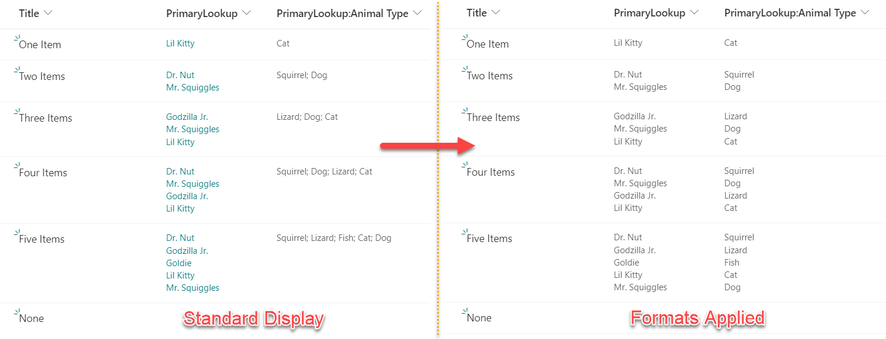
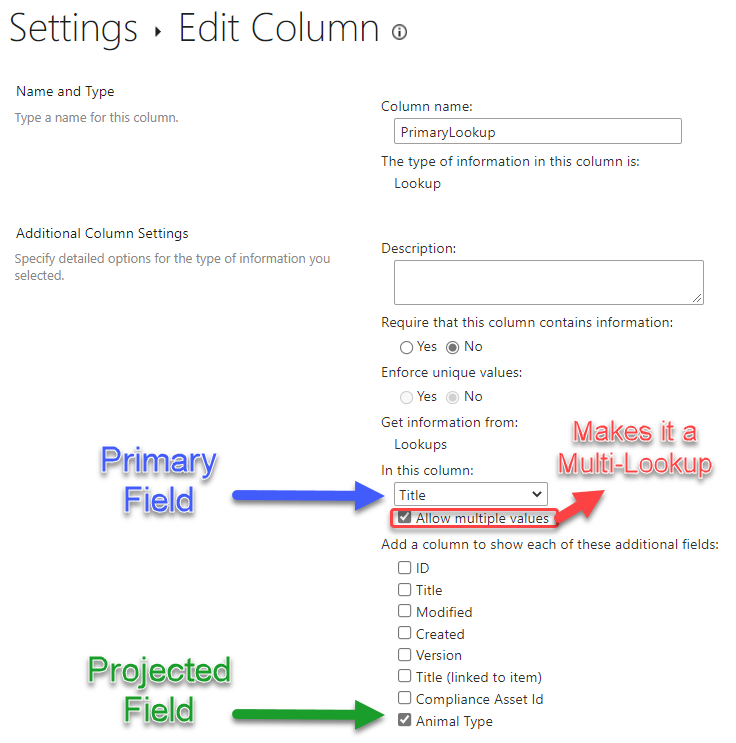

# Multi-lookup fields and projected fields

## Summary
Lookup columns that support multiple values can be formatted using the advanced `forEach` property. Unfortunately, the way values are returned for any projected fields (additional columns associated to your lookup column) can present unique challenges. This sample provides two formats illustrating the difference in how these columns are formatted.

### Multi-Lookup Columns vs Projected Fields

A lookup column becomes a multi-lookup column when you check the _Allow multiple values_ box under the primary column selection in the classic Column Settings screen for the Lookup column. If you check the box for any additional columns, these values become [projected fields](https://docs.microsoft.com/en-us/sharepoint/dev/schema/projectedfields-element-view).

### Formatting Multi-Lookup Columns

The `multi-lookup.json` format should be applied to your primary lookup column. This format uses the [`forEach`](https://docs.microsoft.com/sharepoint/dev/declarative-customization/column-formatting?#foreach) property to act as a template elment for each selected lookup value for an item. This format puts each value in its own box.

We are accessing the value portion of the lookup item by using the `lookupValue` syntax (alternatively, we could access the lookup list's item id for the item with `lookupId`).

### Formatting Multi-Lookup Projected Fields

Unfortunately, multi-lookup projected fields don't come back as nice. Instead of being an array of objects, the values are all joined into a single line of text with multiple values separated by a space and a semi-colon (as seen in the Standard Display above). This means the `forEach` property can't be used. Even sadder, there isn't yet a split operation that would allow us to work with the values as expected.

In this case, we have to get creative with a series of conditional elements that are extracting values using a complex combination of `if`, `substring`, and `indexOf` operators. We make them "conditional" by applying a similar expression to the `display` property of each element to "turn them off" when there isn't a value for a given position.

This is the approach used by the `multi-lookup-projected-field.json` format. It works, but it has some drawbacks:

- It's super complex to read/write
- It can only handle a fixed number of values with each subsequent value having increasingly complex formulas

> The `multi-lookup-projected-field.json` can handle 0-5 values. Anything more than that will require additional elements with even more complex expressions.

## View requirements
- The `multi-lookup.json` format can be applied to any multi-value lookup column
- The `multi-lookup-projected-field.json` format can be applied to any projected field

## Sample

Solution|Author(s)
--------|---------
multi-lookup.json | [Chris Kent](https://twitter.com/thechriskent)
multi-lookup-projected-field.json | [Chris Kent](https://twitter.com/thechriskent)

## Version history

Version|Date|Comments
-------|----|--------
1.0|April 22, 2021|Initial release

## Disclaimer
**THIS CODE IS PROVIDED *AS IS* WITHOUT WARRANTY OF ANY KIND, EITHER EXPRESS OR IMPLIED, INCLUDING ANY IMPLIED WARRANTIES OF FITNESS FOR A PARTICULAR PURPOSE, MERCHANTABILITY, OR NON-INFRINGEMENT.**

---

## Additional notes

- [Use column formatting to customize SharePoint](https://docs.microsoft.com/en-us/sharepoint/dev/declarative-customization/column-formatting#me)

