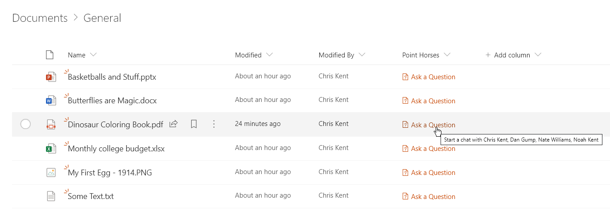

# Multi-Person Teams Chat Link

## Summary
This sample demonstrates creating a deep link to a Microsoft Teams chat. This format works both within Microsoft Teams and within SharePoint Online.

### Link Parts
The Microsoft Teams chat link is broken down into a base URL _https://teams.microsoft.com/l/chat/0/0_ and then query parameters to set portions of the chat:

- _users_ - A comma-separated list of Azure AD UserPrincipalName values (email addresses in this case)
  - This format uses the `join` operator to combine all the email values for the chosen people
- _topicName_ - An optional parameter for the chat's display name (only applies when there are 3+ users)
- _message_ - An optional parameter that sets a starter message in the chat box (doesn't send automatically)

The link is built using the `+` operator to combine the strings together using an expression.

### Differences with Microsoft Teams

There are a few key differences when it comes to creating formats to be used within Microsoft Teams compared to modern list views:
- Subtle differences in CSS defaults. For instance, removing the `vertical-align` style prop on the image will make no difference in a modern list view but will cause problems within Microsoft Teams
- Relative links resolve differently. Always use the `@currentWeb` token to ensure resources are loading from where you expect. Relative links will try and load from teams.microsoft.com when viewed in Teams which is often what you don't want.
- Theme color classes will behave differently. These are respected within list views, but are not yet supported within Microsoft Teams (see screenshots above). Using direct color values will prevent your formats from being theme sensitive/safe, but the values will be consistent between the environments.

## View requirements
- This format can be applied to a Multi-Select Person column
- This format uses operators only available in SharePoint Online and cannot be used in SharePoint 2019
- This format expects to be applied to a document library (relies on `[$FileLeafRef]` but could easily be adapted for a List by using a different field such as `[$Title]`)

## Sample

Solution|Author(s)
--------|---------
multi-person-teams-chat-link.json | [Chris Kent](https://github.com/thechriskent) ([@thechriskent](https://twitter.com/thechriskent))

## Version history

Version|Date|Comments
-------|----|--------
1.0|January 23, 2020|Initial release

## Disclaimer
**THIS CODE IS PROVIDED *AS IS* WITHOUT WARRANTY OF ANY KIND, EITHER EXPRESS OR IMPLIED, INCLUDING ANY IMPLIED WARRANTIES OF FITNESS FOR A PARTICULAR PURPOSE, MERCHANTABILITY, OR NON-INFRINGEMENT.**

---

## Additional notes

- [Use column formatting to customize SharePoint](https://docs.microsoft.com/en-us/sharepoint/dev/declarative-customization/column-formatting)
- [Deep linking to a chat](https://docs.microsoft.com/en-us/microsoftteams/platform/concepts/build-and-test/deep-links#deep-linking-to-a-chat)

