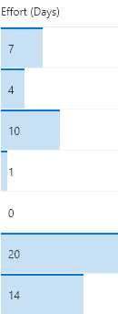
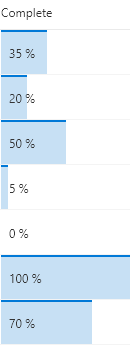

# Format a number column as a data bar

## Summary
These formats apply `background-color` and `border-top` styles to create a data bar visualization of `@currentField`, which is a number field. These styles are applied using the special column formatting class `sp-field-dataBars`. The bars are sized differently for different values based on the way the `width` attribute of the main `div` is set.

### Simple Data Bar (number-data-bar.json)
In this format, the data bar width is set to `100%` when the value is greater than or equal to 20, and `(@currentField * 5)%` when the value is less than 20. This achieves a width of 5% for the data bar for values of 1, 10% for values of 2, and so on. To fit this example to your number column, you can adjust the boundary condition (`20`) to match the maximum anticipated value inside the field, and the multiplier (`5`) to specify how much the bar should grow depending on the value inside the field.

### Percentage Data Bar (percent-data-bar.json)
An additional format is included to illustrate how to apply the same visualization to a number column set to display as a percent. The data bar width is set to the `@currentField`'s value directly and the display text adds the % sign as expected.

## View requirements
- This format can be applied to a Number column

## Sample

Solution|Author(s)
--------|---------
number-data-bar.json | SharePoint Team
percent-data-bar.json | [Chris Kent](https://twitter.com/thechriskent)

## Version history

Version|Date|Comments
-------|----|--------
1.0|November 2, 2017|Initial release
1.1|May 27, 2018|Fixed issue with 0 values and added percentage format
1.2|August 18, 2018|Fixed issue with low value text wrapping and converted to excel-style expressions

## Disclaimer
**THIS CODE IS PROVIDED *AS IS* WITHOUT WARRANTY OF ANY KIND, EITHER EXPRESS OR IMPLIED, INCLUDING ANY IMPLIED WARRANTIES OF FITNESS FOR A PARTICULAR PURPOSE, MERCHANTABILITY, OR NON-INFRINGEMENT.**

---

## Additional notes
This sample is also covered in the main documentation around Column Formatting.

- [Use column formatting to customize SharePoint](https://docs.microsoft.com/en-us/sharepoint/dev/declarative-customization/column-formatting)

A similar wizard is also included in the [Column Formatter](https://github.com/SharePoint/sp-dev-solutions/blob/master/solutions/ColumnFormatter/README.md) webpart that allows full customization.

> Additional versions using Abstract Tree Syntax (AST) are also provided for environments where the Excel-style expressions are not supported.

