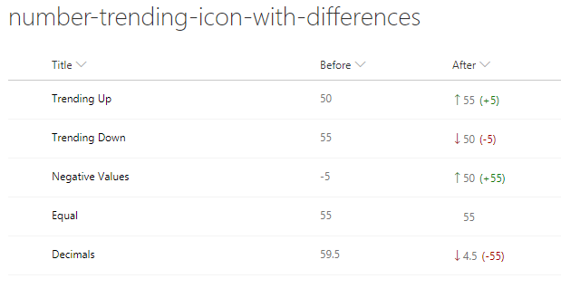

# Show trending up/trending down icons 

## Summary
These formats rely on two number fields, `Before` and `After`, for which the values can be compared. They show the appropriate trending icon next to the value of the `After` field, depending on that field's value compared to the value in `Before`. The `sp-field-trending--up` class is used when `After`'s value is higher; the `sp-field-trending--down` class is used when `After`'s value is lower. No icon is shown when they are equal (padding is added to keep consistent alignment).

### Trending Icons (number-trending-icon.json)

|Condition|Class|Icon|Style|
|---|---|---|---|
|After **>** Before|sp-field-trending--up|SortUp|padding-left:0|
|After **<** Before|sp-field-trending--down|SortDown|padding-left:0|
|After **=** Before|||padding-left:12px|

### Trending Icons with Value Difference (number-trending-icon-with-difference.json)

This format also displays the difference in value between the `Before` and `After` values. If the `After` value is larger then the `Before` value, the numeric value difference will be displayed with a `(+XX)`. If the `After` value is smaller then the `Before` value, the numeric value difference will be displayed with a `(-XX)`.

The difference values are in a ``, separate from the `After` ``, allowing for unique properties to be applied without altering the `After` value.

#### Difference Calculation
|Condition|Expression|Class|
|---|---|---|
|After **>** Before|After - Before|sp-field-trending--up|
|After **<** Before|Before - After|sp-field-trending--down|
|After **=** Before|No Expression Performed||

## View requirements
- This format can be applied to any column
- This format expects a Number column with an internal name of `After`
- This format expects a Number column with an internal name of `Before`

## Sample

Solution|Author(s)
--------|---------
number-trending-icon.json | SharePoint Team
number-trending-icon-with-difference.json | [David Warner II](https://twitter.com/davidwarnerii)

## Version history

Version|Date|Comments
-------|----|--------
1.0|November 2, 2017|Initial release
1.1|March 20, 2018|Added equal value styling
1.2|June 12, 2018|With Difference format added
1.3|August 20, 2018|Updated to use Excel-style expressions

## Disclaimer
**THIS CODE IS PROVIDED *AS IS* WITHOUT WARRANTY OF ANY KIND, EITHER EXPRESS OR IMPLIED, INCLUDING ANY IMPLIED WARRANTIES OF FITNESS FOR A PARTICULAR PURPOSE, MERCHANTABILITY, OR NON-INFRINGEMENT.**

---

## Additional notes
This sample is also covered in the main documentation around Column Formatting.

A similar template is also included in the [Column Formatter](https://github.com/SharePoint/sp-dev-solutions/blob/master/solutions/ColumnFormatter/README.md) webpart.

- [Use column formatting to customize SharePoint](https://docs.microsoft.com/en-us/sharepoint/dev/declarative-customization/column-formatting)

> Additional versions using Abstract Tree Syntax (AST) are also provided for environments where the Excel-style expressions are not supported.

