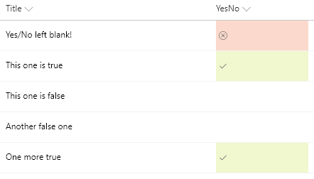

# Formatting Yes/No field to check mark based on the value in the field

## Summary
You can apply conditional formatting to Yes/No fields. This sample applies different classes depending on whether the value of the field is Yes (true), No (false), or Blank. This example applies one of the column formatting [predefined classes](https://docs.microsoft.com/en-us/sharepoint/dev/declarative-customization/column-formatting#predefined-classes) (`sp-field-severity--good`,`sp-field-severity--low`, or `sp-field-severity--blocked`) to the root `
` based on the field's value. Then, it outputs a `` element with an `iconName` attribute that shows an [Office UI Fabric](https://developer.microsoft.com/en-us/fabric#/styles/icons) icon inside that element.

|Value|Class|Icon|
|---|---|---|
|Yes|sp-field-severity--good|Checkmark|
|No|sp-field-severity--low||
|Blank|sp-field-severity--blocked|ErrorBadge|

> Note: the `sp-field-severity--low` class has a white background and since no icon is shown, it is expected that false values will appear to have no display

## View requirements
- This format can be applied to a Yes/No column

## Sample

Solution|Author(s)
--------|---------
yesno-checkmark-format.json | Aaron Miao

## Version history

Version|Date|Comments
-------|----|--------
1.0|November 22, 2017|Initial release
1.1|March 22, 2018|Simplified logic and added blank value icon

## Disclaimer
**THIS CODE IS PROVIDED *AS IS* WITHOUT WARRANTY OF ANY KIND, EITHER EXPRESS OR IMPLIED, INCLUDING ANY IMPLIED WARRANTIES OF FITNESS FOR A PARTICULAR PURPOSE, MERCHANTABILITY, OR NON-INFRINGEMENT.**

---

## Additional notes

