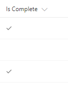

# Yes/No Column Check Mark

## Summary
This example displays a check mark when the value of a Yes/No column is equal to Yes. This field uses the `iconName` attribute to display the `CheckMark` [Office UI Fabric predefined icon](https://developer.microsoft.com/en-us/fabric#/styles/icons).

## View requirements
- This format can be applied to a Yes/No column

## Sample

Solution|Author(s)
--------|---------
yesno-checkmark.json | Travis Lingenfelder

## Version history

Version|Date|Comments
-------|----|--------
1.0|November 27, 2017|Initial release
1.1|March 22, 2018|Simplified logic
1.2|August 20, 2018|Switched to Excel-style expression

## Disclaimer
**THIS CODE IS PROVIDED *AS IS* WITHOUT WARRANTY OF ANY KIND, EITHER EXPRESS OR IMPLIED, INCLUDING ANY IMPLIED WARRANTIES OF FITNESS FOR A PARTICULAR PURPOSE, MERCHANTABILITY, OR NON-INFRINGEMENT.**

---

## Additional notes

For more information on using this custom formatting see the article [Check Mark SharePoint Modern List Column Format](http://www.constellationsolutions.com/how-to/check-mark-sharepoint-modern-list-column-format/)

> An additional version using Abstract Tree Syntax (AST) is also provided for environments where the Excel-style expressions are not supported.

