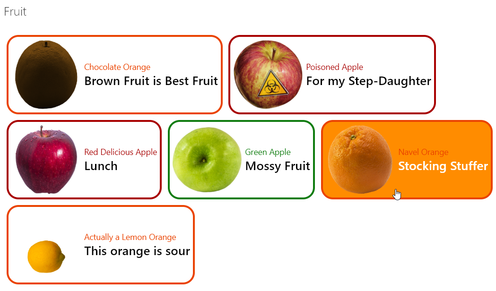

# ContentType Format

## Summary
Provides an example of customizing your format based on the item's content type. When an item's ContentType is Apple and the apple type is "Green" then green is used in the format. It it's Apple with a different type, red is used. Otherwise, orange is used.

The `rowFormatter` property is used to fully customize the display of rows to create a simple view of list items while easily allowing users to click on the item for additional details. The colors used for each item are applied using the Office UI Fabric color classes for themes. These classes are then applied conditionally based on an item's content type.

Both `ContentType` and `ContentTypeId` are always available (even when not explicitly part of your view) and can be referenced. However, ContentTypeId is the List ContentType's Id and will be specific to the list and will require updating this value to apply the format to other sites/lists.

ContentType is available as long as it is NOT part of the view. This is a known limitation in List Formatting.



## List requirements
The list has enabled mangement of Content Types and 2 custom content types have been added. Additionally, the format expects images that correspond with the choice values to be located in the Documents library on the site within the Fruit folder. Sample images have been included.

### Apple Content Type
|Type|Internal Name|Required|
|---|---|:---:|
|Single line of text|Title|Yes|
|Choice|AppleType|Yes|

#### AppleType Choices
- Red Delicious
- Poisoned
- Green

> Note: Only Green is used within the format, all other choices are not important but are provided for those trying to recreate the sample exactly

### Orange Content Type
|Type|Internal Name|Required|
|---|---|:---:|
|Single line of text|Title|Yes|
|Choice|OrangeType|Yes|

#### OrangeType Choices
- Navel
- Chocolate
- Actually a Lemon

> Note: the specific choices are not important but are provided for those trying to recreate the sample exactly

## View requirements

|Type|Internal Name|Required|
|---|---|:---:|
|Single line of text|Title|Yes|
|Choice|AppleType|Yes|
|Choice|OrangeType|Yes|

## Provisioning
Included with this sample is FruitTemplate.xml this is a PnP Provisioning template that will automatically add the Site Columns, ContentTypes, Images, and List with the format applied. This is not required, but it is a lot easier to see the sample in action immediately since it let's you skip manually creating everything.

You will need to have [SharePoint PnP PowerShell for Online](https://docs.microsoft.com/en-us/powershell/sharepoint/sharepoint-pnp/sharepoint-pnp-cmdlets?view=sharepoint-ps) installed. Then you can simply run the following commands from a directory where the template and the Fruit folder are located:

```bash
Connect-PnPOnline https://mytenant.sharepoint.com/sites/mysite
Apply-PnPProvisioningTemplate -Path FruitTemplate.xml
```

## Sample

Solution|Author(s)
--------|---------
contenttype-format | [Chris Kent](https://twitter.com/thechriskent)

## Version history

Version|Date|Comments
-------|----|--------
1.0|December 19, 2018|Initial release
1.1|January 9, 2019|Adjusted image src to use @currentWeb

## Disclaimer
**THIS CODE IS PROVIDED *AS IS* WITHOUT WARRANTY OF ANY KIND, EITHER EXPRESS OR IMPLIED, INCLUDING ANY IMPLIED WARRANTIES OF FITNESS FOR A PARTICULAR PURPOSE, MERCHANTABILITY, OR NON-INFRINGEMENT.**

---

## Additional notes

Using the `customRowAction` with an `action` of `defaultClick` creates a great way to make your list into a master view with details easily accessible. This sample wraps the entire row in a button so that you can click anywhere in the row to open the information panel for the item

The image's src attribute uses the `@currentWeb` token to ensure that regardless of where the format is rendered, the images will be pulled from the fruit folder in the Documents library for the site.


