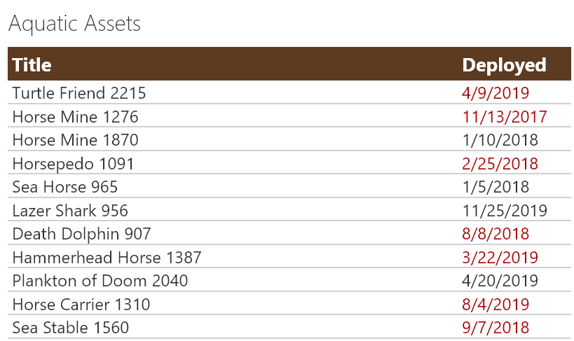
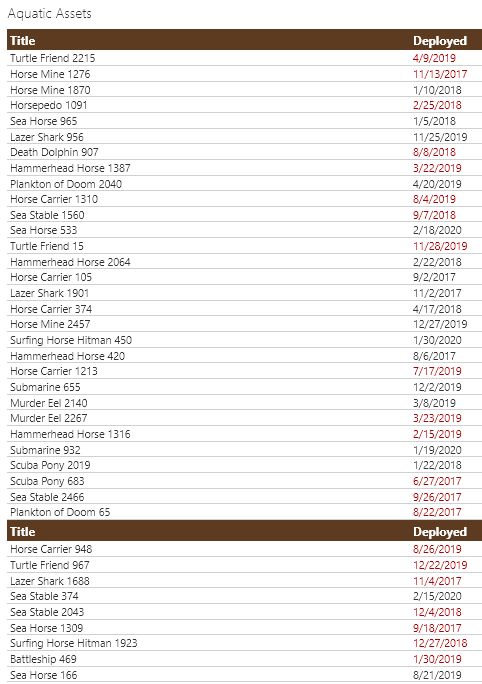

# Custom Header

## Summary
Sometimes it is necessary to remove the standard headers. In those cases, you may still want to show a custom header. This sample demonstrates creating a custom header and only showing it on the first row. The key to this technique is setting the `display` style attribute to `none` (hidden) whenever the `@rowIndex` is not 0 (first row).

Creating a custom header removes the standard features such as menus, sorting, moving, resizing, etc. In addition, the sticky header feature is now gone. So an additional sample, custom-header-repeating-format.json is provided that demonstrates drawing the custom header every 30 rows.

## View requirements
The concept can be adjusted for any view, but this specific format expects the following columns to be part of the view:

|Type|Internal Name|Required|
|---|---|:---:|
|Single line of text|Title|Yes|
|Date|Deployed|Yes|
|Yes/No|Active|Yes|

## Sample

Solution|Author(s)
--------|---------
custom-header.json | [Chris Kent](https://github.com/thechriskent) ([@thechriskent](https://twitter.com/thechriskent))
custom-header-repeating.json | [Chris Kent](https://github.com/thechriskent) ([@thechriskent](https://twitter.com/thechriskent))

## Version history

Version|Date|Comments
-------|----|--------
1.0|February 20, 2020|Initial release

## Disclaimer
**THIS CODE IS PROVIDED *AS IS* WITHOUT WARRANTY OF ANY KIND, EITHER EXPRESS OR IMPLIED, INCLUDING ANY IMPLIED WARRANTIES OF FITNESS FOR A PARTICULAR PURPOSE, MERCHANTABILITY, OR NON-INFRINGEMENT.**

---

## Additional notes

