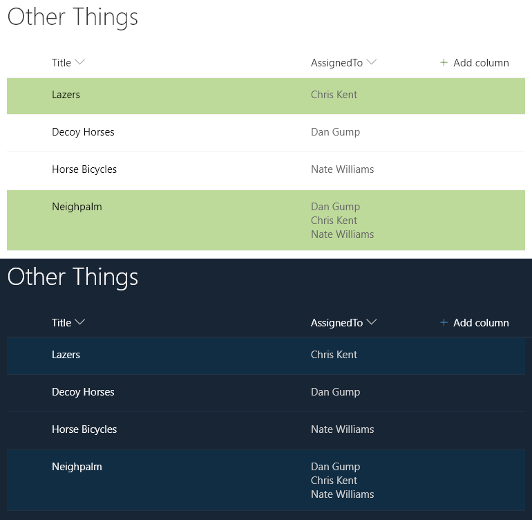

# Current User's Rows (Using a Multi-Person Column)

## Summary
Highlights the entire row for any list items where one of the assigned to users is the current user (the user viewing the list view, not the author of the format). You can easily adjust this to use a different person column by changing the `[$AssignedTo]` portion of the expression.

By using the Office UI Fabric color classes for themes, we can ensure our format looks good in all themes including both light and dark as well as custom themes.

## View requirements
- This format expects a person column with an internal name of `AssignedTo` to be part of the view. This column can be single or multi-select.

## Sample

Solution|Author(s)
--------|---------
multi-person-currentuser-rowclass | [Chris Kent](https://twitter.com/thechriskent)

## Version history

Version|Date|Comments
-------|----|--------
1.0|January 29, 2019|Initial release

## Disclaimer
**THIS CODE IS PROVIDED *AS IS* WITHOUT WARRANTY OF ANY KIND, EITHER EXPRESS OR IMPLIED, INCLUDING ANY IMPLIED WARRANTIES OF FITNESS FOR A PARTICULAR PURPOSE, MERCHANTABILITY, OR NON-INFRINGEMENT.**

---

## Additional notes

This sample works for **both** single and multi-select person fields.However, an additional sample is available intended for use with single-select person fields: [person-currentuser-rowclass](../person-currentuser-rowclass). It is a simpler sample intended to show how to use the `@me` operator.

