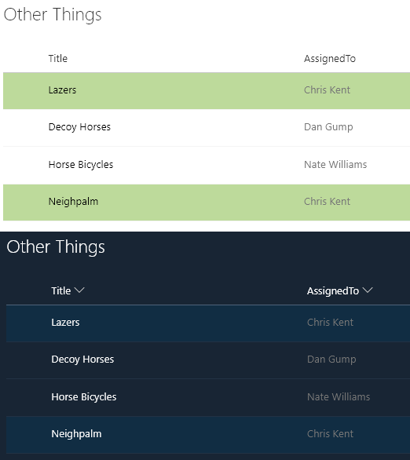
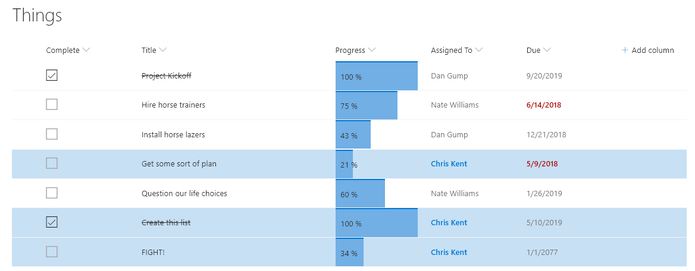

# Current User's Rows

## Summary
Highlights the entire row for any list items assigned to the current user (the user viewing the list view, not the author of the format). You can easily adjust this to use a different column like Author or Editor by changing the `[$AssignedTo]` portion of the expression.

By using the Fluent UI color classes for themes, we can ensure our format looks good in all themes including both light and dark as well as custom themes.

## View requirements
- This format expects a person column with an internal name of `AssignedTo` to be part of the view 

> Note - This format is intended only for single-select person fields. There is a slightly more complicated sample ([multi-person-currentuser-rowclass](../multi-person-currentuser-rowclass)) that works for both single and multi-select person columns.

## Sample

Solution|Author(s)
--------|---------
person-currentuser-rowclass.json | [Chris Kent](https://github.com/thechriskent) ([@thechriskent](https://twitter.com/thechriskent))

## Version history

Version|Date|Comments
-------|----|--------
1.0|August 21, 2018|Initial release

## Disclaimer
**THIS CODE IS PROVIDED *AS IS* WITHOUT WARRANTY OF ANY KIND, EITHER EXPRESS OR IMPLIED, INCLUDING ANY IMPLIED WARRANTIES OF FITNESS FOR A PARTICULAR PURPOSE, MERCHANTABILITY, OR NON-INFRINGEMENT.**

---

## Additional notes

Because this format is only using the `additionalRowClass` property, it can be combined with column formats to make a pretty compelling visualization:

Column Format samples shown above:
- [yesno-checkbox](../../column-samples/yesno-checkbox)
- [text-strikethrough](../../column-samples/text-strikethrough)
- [number-data-bar](../../column-samples/number-data-bar)
- [person-currentuser-format](../../column-samples/person-currentuser-format)
- [date-range-format](../../column-samples/date-range-format)

A similar sample is available for use with multi-select person fields: [multi-person-currentuser-rowclass](../multi-person-currentuser-rowclass)

