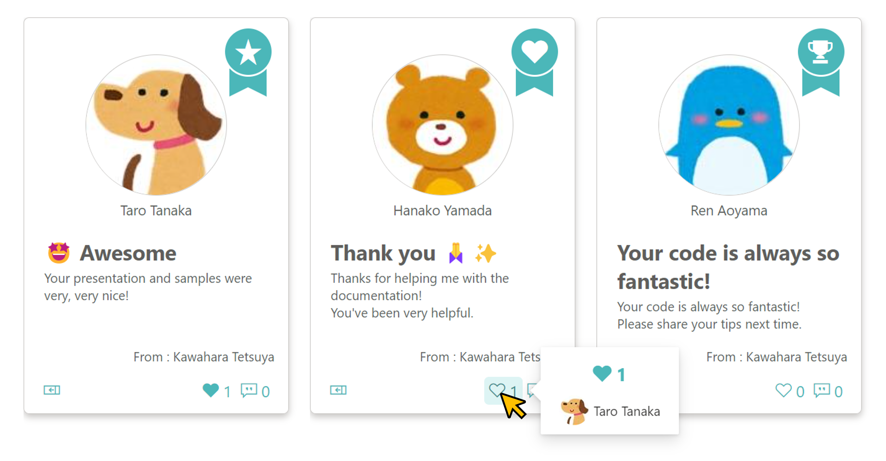

# Praise Card

## Summary
This sample demonstrates how to display the Praise Card. By creating a Praise Card, you can express your appreciation and admiration to others for their daily cooperation and actions.

## View requirements

|Type               |Internal Name|Required|
|-------------------|-------------|:------:|
|Single line of text|Title        |Yes     |
|Single line of text|Description  |        |
|Person             |From         |Yes     |
|Person             |To           |Yes     |
|Single line of text|Icon         |        |
|Multi-Select Person|Likes        |        |

- You need to use the Gallery View.
- Set the name of the Fluent UI Icon in the `Icon` field.

## Sample

Solution                     |Author(s)
-----------------------------|---------------------------
praise-card-tile-format.json |[Tetsuya Kawahara](https://twitter.com/techan_k)

## Version history

Version |Date             |Comments
--------|-----------------|--------------------------------
1.0     |January 23, 2022 |Initial release

## Disclaimer
**THIS CODE IS PROVIDED *AS IS* WITHOUT WARRANTY OF ANY KIND, EITHER EXPRESS OR IMPLIED, INCLUDING ANY IMPLIED WARRANTIES OF FITNESS FOR A PARTICULAR PURPOSE, MERCHANTABILITY, OR NON-INFRINGEMENT.**

## Additional notes
- [Fluent UI Icons](https://developer.microsoft.com/en-us/fluentui#/styles/web/icons)

